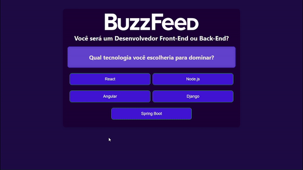

# BuzzFeed Quiz Clone

Este projeto é uma simulação de um quiz no estilo BuzzFeed, desenvolvido em Angular. Ele permite que os usuários respondam a uma série de perguntas e recebam um resultado baseado nas respostas fornecidas. 📝✨

O objetivo deste quiz é ajudar os usuários a descobrirem se têm mais afinidade com o desenvolvimento **front-end** 🎨 ou **back-end** 🛠️, baseado em suas respostas a uma série de perguntas.


<p align="center">
  
</p>

## ⚙️ Funcionalidades 

- **Interface Interativa:** Layout intuitivo e responsivo.
- **Perguntas Dinâmicas:** As perguntas são carregadas dinamicamente de um conjunto pré-definido.
- **Resultados Baseados em Respostas:** O resultado é calculado e exibido ao usuário com base nas respostas fornecidas.
- **Design Personalizado:** Estilização única seguindo a preferência de cores do projeto.

## 🛠️ Tecnologias Utilizadas 

- **Angular:** Framework principal utilizado para o desenvolvimento da aplicação.
- **TypeScript:** Linguagem de programação usada para adicionar tipagem estática ao JavaScript.
- **CSS:** Estilização dos componentes e layout da aplicação.
- **HTML:** Estruturação das páginas do quiz.


## 🚀 Como Executar o Projeto 

1. Clone este repositório para sua máquina local:

```bash
https://github.com/joschonarth/angular-buzzfeed-quizz-clone
```

2. Acesse o diretório do projeto:

```bash
cd buzzfeed-clone
```

3. Instale as dependências do projeto:

```bash
npm install
```
4. Execute o servidor de desenvolvimento:

```bash
ng serve
```

5. Abra o navegador e acesse `http://localhost:4200` para visualizar o projeto.


## 🎨 Personalização 

Você pode personalizar as perguntas e os resultados editando o arquivo `quizz_questions.json` localizado na pasta `src/assets/data`.

## 🤝 Contribuição 

Contribuições são bem-vindas! Sinta-se à vontade para abrir uma issue ou enviar um pull request.

## 📞 Contato 

<div>
    <a href="https://www.linkedin.com/in/joschonarth/" target="_blank"></a>
    <a href="mailto:joschonarth@gmail.com" target="_blank"></a>
</div>